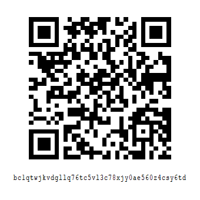

# 寄付・献金/Donation
Copyright (C) 2020-2025 Yigty.ORG; all rights reserved.
Copyright (C) 2020-2025 Takym.

## 概要
* Yigty.ORG への寄付にご興味を持って頂きありがとうございます。
* 開発費及び開発者の生活費の為に[募金](#脚注)しております。
* Thank you for your interest in donating to Yigty.ORG!
* We are collecting donations to cover developing costs and living expenses.

## Yigty.ORG 宛に寄付・献金する（Donate to Yigty.ORG）
只今準備中です。気長にお待ちください。
尚、現在の Yigty.ORG の構成員は Takym のみです。

Now preparing...... Please wait patiently.
Furthermore, the current Yigty.ORG member is only Takym.

## [@Takym](https://github.com/Takym) 宛に寄付・献金する（Donate to Takym）
私、たかやまは GitHub Sponsors、Bitcoin、または Monacoin での寄付を求めています。

I, Takym, would like you to donate with GitHub Sponsors, Bitcoin, or Monacoin.

### GitHub Sponsors
<https://github.com/sponsors/Takym>

### Bitcoin
```
bc1qtwjkvdgllq76tc5vl3c78xjy0ae560z4csy6td
```



(このQRコードは Bitcoin Core を利用して生成しました。) <br />
(This QR code is generated with Bitcoin Core.)

### Monacoin
```
mona1qhyqqhc35v886xnxqtqghcv0pfk0r6qn6qjwh9y
```


(このQRコードは Monacoin Core を利用して生成しました。) <br />
(This QR code is generated with Monacoin Core.)

### その他
* LINEスタンプ「ジカッキィー」を買う
	* [LINEスタンプ](https://line.me/S/shop/sticker/author/197955/new?lang=ja&utm_source=gnsh_staut)
	* [公式アカウント](https://lin.ee/5sJ1DQ9)
	* [公式ブログ](https://takym.github.io/blog/jikkaky/README.html)
* Lancers で仕事を依頼する
	* [私のプロフィール](https://www.lancers.jp/affiliate/track?id=2119206&link=/profile/takym)

## もっと募金に協力するには
このページを SNS 等で拡く共有してください！

## 脚注
* **募金**：寄付金を募る。集める。
* **献金**：寄付金を献上する。寄付する。
